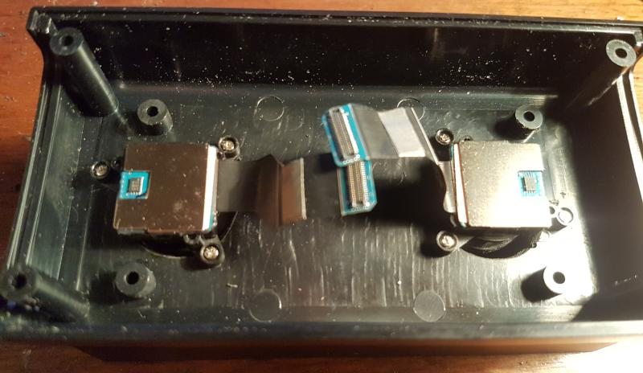
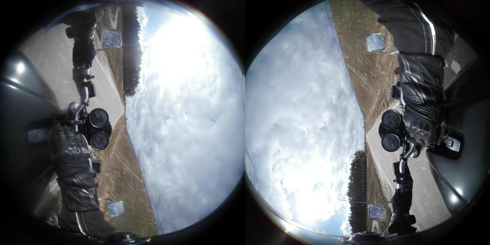
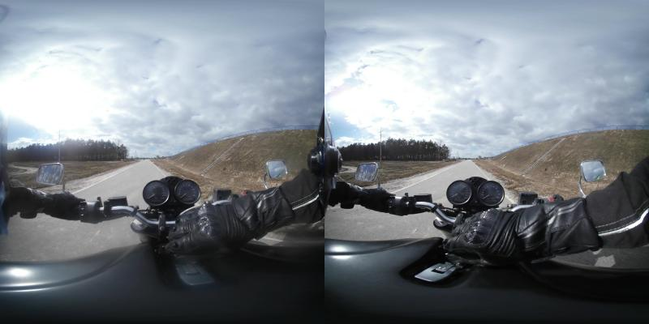

 # About

 This is a super simple script to make 3D (stereo) 180 x 180 degrees videos from videos recorded on modified Gear 360. It currently runs on Linux and supports 3840 x 1920 videos from the first generation of Gear 360 (Samsung SM-C200).
 
 # How to modify Gear 360
 
 Recording stereoscopic video requires two cameras facing in the same direction. You need tear down a Gear 360, put cameras in a new case, on the same plane. They have to be rotated by 90 degrees, otherwise ribbons whould be too short.
 
 
 
 Distance between cameras should be similar to human IPD. For example Gear VR headset uses 62 mm fixed IPD. 
 
 # Requirements
 
* Linux
* [Hugin](http://hugin.sourceforge.net/).
* [ImageMagick](https://www.imagemagick.org/)
* [ffmpeg](https://ffmpeg.org/download.html).
* [GNU Parallel](https://www.gnu.org/software/parallel/)

For Ubuntu just run package manager:

    sudo apt install hugin parallel ffmpeg imagemagick


 # How to use?

 Copy uncorverted video from the modified Gear 360 camera. It should look like this:
 
 
 
 Copy files from this repository (convertvideo.sh, imageproj.sh and gearstereo.pto) to the same directory. Then run:
 
    ./convertvideo.sh 360_XXXXX.MP4
    
 or
 
    bash convertvideo.sh 360_XXXXX.MP4

 The script will create a new video called ``` 360_XXXXX_180x180_3dh.mp4 ``` that should look like this:
 
 

 
 The file can be viewed on Gear VR using Samsung VR (Milk VR) software. 
 If you want publish it on Youtube, you have to inject VR180 metadata using this [spatial-media](https://github.com/Vargol/spatial-media) script.
 
 [Here is a test video on Youtube](https://www.youtube.com/watch?v=YAmRJcZcyMs) It can be viewed using carboard mode. If you use Gear VR, then you can watch the video inside Samsung Internet - fullscreen and 180 degrees SBS mode have to be nabled.
